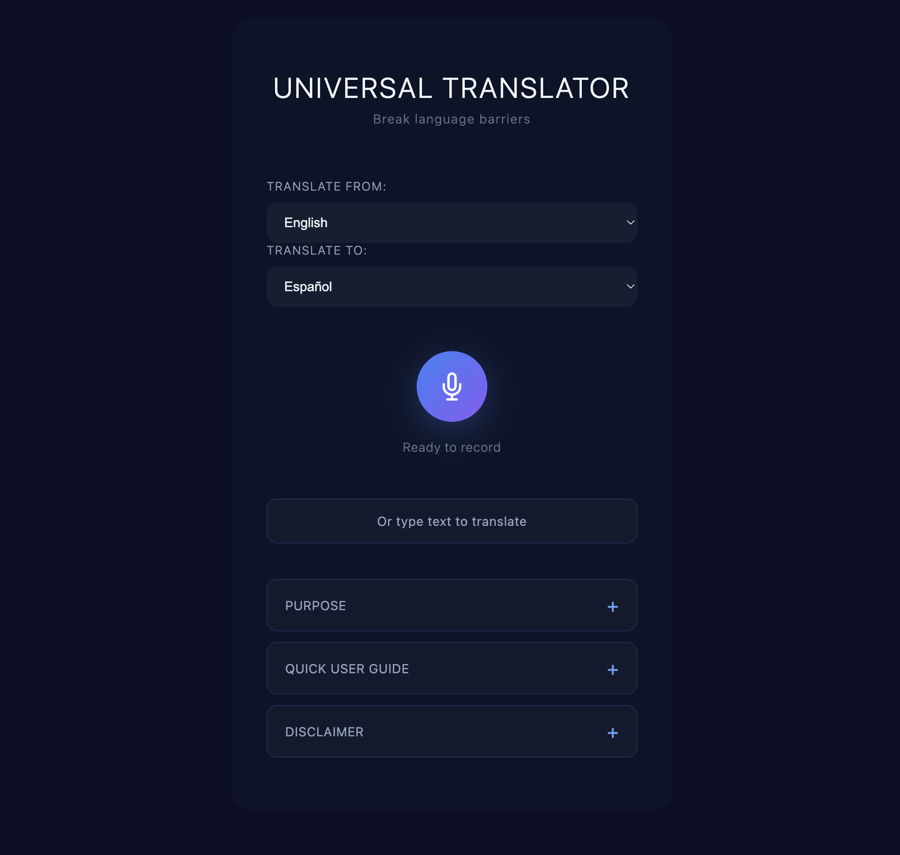

# Translate speech across 100+ languages with AI

Break language barriers with real-time speech translation using open-source AI models deployed on Red Hat OpenShift AI®.



## Table of Contents

- [Overview](#overview)
- [Detailed description](#detailed-description)
  - [See it in action](#see-it-in-action)
  - [Architecture diagrams](#architecture-diagrams)
- [Requirements](#requirements)
  - [Minimum hardware requirements](#minimum-hardware-requirements)
  - [Minimum software requirements](#minimum-software-requirements)
  - [Required user permissions](#required-user-permissions)
- [Deploy](#deploy)
  - [Prerequisites](#prerequisites)
  - [Installation](#installation)
  - [Validating the deployment](#validating-the-deployment)
  - [Delete](#delete)
- [Repository structure](#repository-structure)
- [References](#references)
- [Technical details](#technical-details)
- [Tags](#tags)

## Overview

The Universal Translator demonstrates speech translation across 100+ languages using open-source models. Users speak or type in one language and receive translations, enabling real-time communication across language barriers without requiring external APIs or cloud services. 

## Detailed description

In global organizations, educational institutions, and customer service environments, language barriers create significant communication challenges. Teams need to collaborate across languages, support multilingual customers, and enable real-time translation without sending sensitive data to external services.

This quickstart deploys a complete speech translation pipeline using state-of-the-art open-source AI models. It combines OpenAI's Whisper for speech recognition with Meta's M2M-100 for translation, supporting over 100 languages. The entire stack runs self-hosted on OpenShift AI , ensuring data privacy and compliance.

Key features include:
- Real-time speech-to-text transcription in 99+ languages
- Text input alternative for accessibility
- Web interface with audio waveform visualization
- Fully containerized deployment via Helm
- 100% open-source stack (MIT/Apache 2.0 licenses)

### See it in action

[Demo video and interactive walkthrough coming soon]

### Architecture diagrams

```
┌─────────────┐     ┌──────────────┐     ┌────────────────────┐
│  Frontend   │────▶│   Gateway    │────▶│  Whisper (GPU)     │
│  (Nginx)    │     │  (FastAPI)   │     │  Speech-to-Text    │
│             │◀────│              │     │  vLLM Runtime      │
└─────────────┘     └──────┬───────┘     └────────────────────┘
                           │
                           ▼
                    ┌────────────────────┐
                    │  M2M-100 (CPU/GPU) │
                    │  Translation       │
                    │  1.2B Parameters   │
                    └────────────────────┘
```

## How It Works

**1. Select Languages:** Choose your source language (what you'll speak) and target language (desired translation) from 100+ available options

**2. Record Audio:** Click the microphone button to start recording
   - Real-time waveform visualization shows your voice input
   - Frontend captures audio in WebM format

**3. Stop Recording:** Click the microphone button again to stop
   - Audio is automatically sent to the Gateway service
   - Frontend sends audio file to Gateway via `/translate-speech` endpoint

**4. Speech Recognition:** Gateway forwards your audio to Whisper InferenceService
   - Whisper Large-v3 running on GPU transcribes speech to text
   - Processing time: 1-3 seconds on GPU

**5. Translation:** Gateway sends transcribed text to M2M-100 Translation Service
   - M2M-100 1.2B model translates text to target language
   - Processing time: 3-8 seconds on CPU, 400-800ms on GPU. Dependent on size of translation.

**6. View Results:** Translated text returns to frontend and appears in the main display
   - Text is capitalized and formatted for readability
   - Original transcription available via "Show Original Text" button

**7. Text Alternative:** Prefer typing? Expand "Or type text to translate"
   - Enter text directly and click "Translate Text"

**Processing time:** ~4-11 seconds total for speech translation on CPU (Whisper on GPU + M2M-100 on CPU), ~2-4 seconds with GPU acceleration for M2M-100.

**Supported languages:** 100 languages including English, Spanish, French, German, Italian, Portuguese, Russian, Japanese, Chinese, Arabic, Hindi, Korean, and 88+ more.

## Use Cases

### Global Organizations
Real-time collaboration across multilingual teams without external translation services. Enable seamless communication between offices in different countries while maintaining data privacy with self-hosted infrastructure.

### Education
Support multilingual classrooms and international students with instant translation. Demonstrate AI speech processing and translation capabilities. Provide accessible communication tools for students with hearing or language barriers.

### Healthcare Providers
Facilitate patient communication across language barriers with HIPAA-compliant, self-hosted translation. No patient data leaves your infrastructure. Support emergency communication when interpreters aren't immediately available.

### Government Services
Provide multilingual constituent services and public interfaces. Enable international relations and diplomatic communications. Maintain data sovereignty with fully self-hosted translation infrastructure.

### Customer Service
Deliver multilingual support without relying on third-party APIs or cloud services. Maintain conversation privacy and compliance with data protection regulations. Support customers in 100+ languages with a single deployment.

## Requirements

### Minimum hardware requirements

**Frontend:**
- CPU: 100m vCPU (request) / 200m vCPU (limit)
- Memory: 128 MiB (request) / 256 MiB (limit)

**Gateway:**
- CPU: 200m vCPU (request) / 500m vCPU (limit)
- Memory: 256 MiB (request) / 512 MiB (limit)

**M2M-100 Translation Service:**
- CPU: 4 vCPU (request) / 6 vCPU (limit)
- Memory: 8 GiB (request) / 12 GiB (limit)
- GPU: Optional (recommended for faster translation, ~400-800ms vs 3-8s on CPU)

**Whisper Speech-to-Text (if deploying via Helm):**
- CPU: 2 vCPU (request) / 2 vCPU (limit)
- Memory: 8 GiB (request) / 8 GiB (limit)
- GPU: 1 NVIDIA GPU (A10, A100, L40S, T4, or similar)

**Total minimum requirements:**
- CPU: ~6.3 vCPU (without Whisper) or ~8.3 vCPU (with Whisper)
- Memory: ~8.9 GiB (without Whisper) or ~16.9 GiB (with Whisper)
- GPU: 1 NVIDIA GPU if deploying Whisper

> **Note**: The Whisper InferenceService deployment is optional. You can deploy Whisper separately or use an existing deployment and configure the gateway to use it.

### Minimum software requirements

**Tested with:**
- OpenShift 4.22
- OpenShift AI 3.4
- Helm 3.12 or later
- oc CLI 4.14 or later

**Required operators:**
- OpenShift AI operator


### Required user permissions

This quickstart can be deployed by any user with:
- Permission to create projects/namespaces
- Permission to deploy applications via Helm
- Permission to create InferenceServices (if deploying Whisper)
- No cluster admin access required

## Deploy

### Prerequisites

Before deploying, ensure you have:
- Access to a Red Hat OpenShift cluster with OpenShift AI 3.4+ installed
- `oc` CLI (version 4.14+) installed and authenticated
- `helm` CLI (version 3.12+) installed
- At least one GPU-enabled node available (if deploying Whisper)

### Installation

1. Clone the repository:
```bash
git clone https://github.com/rh-ai-quickstart/the-universal-translator.git
cd the-universal-translator
```

2. Create a new OpenShift project:
```bash
oc new-project universal-translator
```

3. Install using Helm:

**Option A: Deploy with Whisper included (requires GPU)**

```bash
helm install universal-translator ./chart --namespace universal-translator
```

This deploys all components including the Whisper InferenceService. Whisper will be scheduled on a GPU node.

**Option B: Use existing Whisper deployment**

If you already have Whisper deployed elsewhere, disable the InferenceService and point to your existing endpoint:

```bash
helm install universal-translator ./chart --namespace universal-translator \
  --set whisper.enabled=false \
  --set whisper.url="http://your-whisper-service:8080"
```

### Validating the deployment

1. Check all pods are running:
   ```bash
   oc get pods -n universal-translator
   ```
   
   You should see:
   - `universal-translator-frontend-*` (Running)
   - `translator-gateway-*` (Running)
   - `m2m100-service-*` (Running)
   - `whisper-large-v3-predictor-*` (Running, if deployed via Helm)

2. Wait for M2M-100 to fully load (may take 3-5 minutes):
   ```bash
   oc logs -f deployment/m2m100-service -n universal-translator
   ```
   
   Wait until you see: `Model loaded successfully!`

3. Get the application URL:
   ```bash
   echo https://$(oc get route/universal-translator -n universal-translator --template='{{.spec.host}}')
   ```

4. Open the URL in your browser and test:
   - Select source and target languages
   - Click the microphone button and speak
   - View the translation

   Or use the text input option:
   - Expand "Or type text to translate"
   - Enter text and click "Translate Text"

### Delete

To completely remove the deployment:

1. Uninstall the Helm release:
   ```bash
   helm uninstall universal-translator --namespace universal-translator
   ```

2. (Optional) Delete the project:
   ```bash
   oc delete project universal-translator
   ```

## Repository structure

```
.
├── chart/                    # Helm chart for deploying the Universal Translator
│   ├── Chart.yaml            # Chart metadata (version 1.0.0)
│   ├── values.yaml           # Configuration (Whisper toggle, service URLs)
│   └── templates/            # Kubernetes resource templates
│       ├── whisper-inferenceservice.yaml  # KServe InferenceService for Whisper
│       ├── frontend.yaml     # Nginx frontend (Deployment + Service + Route)
│       ├── gateway.yaml      # FastAPI gateway (Deployment + Service)
│       └── m2m100.yaml       # M2M-100 translation (Deployment + Service)
├── docs/
│   └── images/               # Architecture diagrams and screenshots
└── README.md
```


## References

- [OpenAI Whisper - Speech Recognition Model](https://github.com/openai/whisper)
- [Meta M2M-100 - Multilingual Translation](https://huggingface.co/facebook/m2m100_1.2B)
- [OpenShift AI Documentation](https://docs.redhat.com/en/openshift-ai)
- [KServe Documentation](https://kserve.github.io/website/)
- [vLLM Serving Engine](https://github.com/vllm-project/vllm)

## Technical details

### Models Used

**Whisper Large-v3**
- Architecture: Transformer-based speech recognition
- Size: ~3 GB
- Languages: 99+
- Deployment: vLLM runtime on KServe
- Storage: Red Hat modelcar catalog (OCI registry)
- Performance: 1-3 seconds per audio clip on GPU

**M2M-100 1.2B**
- Architecture: Multilingual translation transformer
- Parameters: 1.2 billion
- Size: ~5 GB
- Languages: 100 languages, 9,900 translation pairs
- Deployment: FastAPI service with HuggingFace transformers
- Performance: 3-8 seconds on CPU, 400-800ms on GPU

### API Endpoints

**Gateway Service** (`http://translator-gateway:8000`)
- `POST /translate-speech` - Upload audio file for transcription + translation
  - Form data: `audio` (file), `source_lang` (code), `target_lang` (code)
  - Returns: `{original_text, translated_text, source_language, target_language}`
  
- `POST /translate-text` - Text-only translation (bypasses Whisper)
  - JSON: `{text, source_lang, target_lang}`
  - Returns: `{original_text, translated_text, source_language, target_language}`


**M2M-100 Service** (`http://m2m100-service:8000`)
- `POST /translate` - Direct translation
  - JSON: `{text, source_language, target_language}`
  - Returns: `{translated_text}`

- `GET /languages` - List supported language codes

**Whisper Service** (`http://whisper-large-v3-predictor:8080`)
- `POST /v1/audio/transcriptions` - OpenAI-compatible transcription
  - Form data: `file` (audio)
  - Returns: `{text}`

### Configuration

The Helm chart exposes minimal configuration via `values.yaml`:

```yaml
whisper:
  enabled: true  # Deploy Whisper InferenceService
  url: "http://whisper-large-v3-predictor.universal-translator.svc.cluster.local:8080"
```


### Resource Optimization

- **CPU-only deployment**: Works but translation is slower (3-8s vs 400-800ms on GPU)
- **GPU acceleration**: Whisper requires GPU; M2M-100 benefits from GPU but not required
- **Smaller model option**: Can use M2M-100 418M instead of 1.2B for faster CPU performance at slightly lower quality


## Credits

**Built by:** Red Hat CAI Team  
**Powered by:** Red Hat OpenShift AI  
**Models:** Whisper by OpenAI, M2M-100 by Meta AI   
**Base Images:** Red Hat Universal Base Image 9 (UBI9)  
**Maintained by:** Sara Banderby

## Tags

- **Title:** Translate speech across 100+ languages with AI
- **Industry:** Education
- **Use case:** Translation, Communication, Accessibility
- **Contributor org:** Red Hat